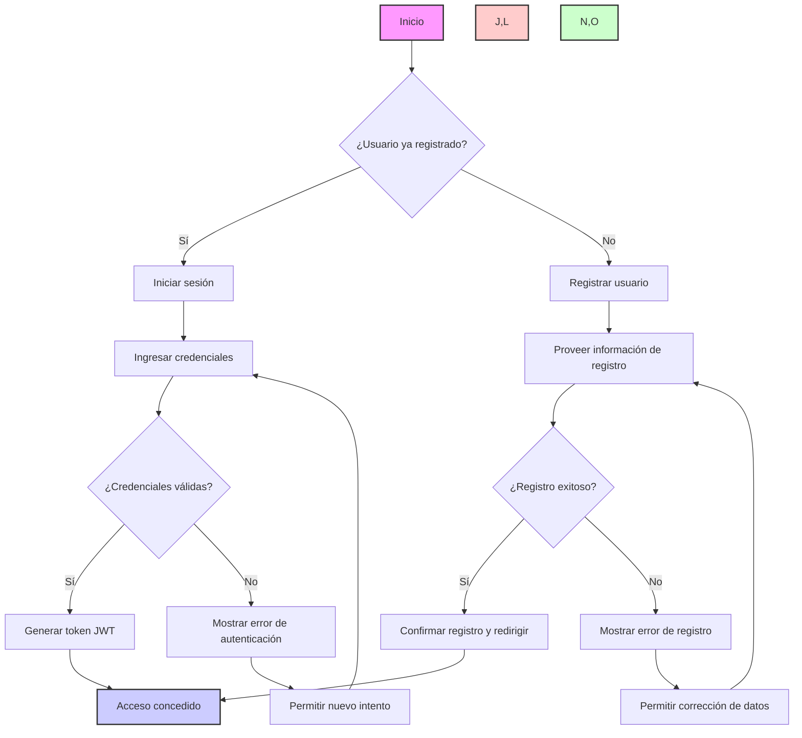

```mermaid
flowchart TD
    A[Inicio] --> B{¿Usuario ya registrado?}
    B -- Sí --> C[Iniciar sesión]
    B -- No --> D[Registrar usuario]

    C --> E[Ingresar credenciales]
    D --> F[Proveer información de registro]

    E --> G{¿Credenciales válidas?}
    F --> H{¿Registro exitoso?}

    G -- Sí --> I[Generar token JWT]
    G -- No --> J[Mostrar error de autenticación]

    H -- Sí --> K[Confirmar registro y redirigir]
    H -- No --> L[Mostrar error de registro]

    I --> M[Acceso concedido]
    K --> M

    J --> N[Permitir nuevo intento]
    L --> O[Permitir corrección de datos]

    N --> E
    O --> F

    style A fill:#f9f,stroke:#333,stroke-width:2px
    style M fill:#ccf,stroke:#333,stroke-width:2px
    style J,L fill:#fcc,stroke:#333,stroke-width:2px
    style N,O fill:#cfc,stroke:#333,stroke-width:2px
```
